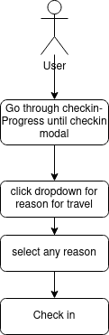
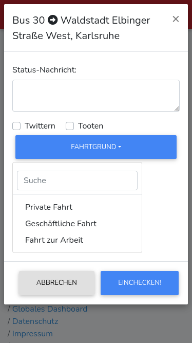

# 1 Use-Case Name
Business Checkin

## 1.1 Brief Description
Setting the reason for your Check-Ins (private and business travel)

Users want to be able to track their travel routes in detail just like in a driver's logbook

# 2 Flow of Events
## 2.1 Basic Flow
- User is in the "check in" view
- User selects from one of multiple travel Types (private, business, travel to work)
- User clicks "check in"

### 2.1.1 Activity Diagram


### 2.1.2 Mock-up


### 2.1.3 Narrative
```gherkin
Feature: user search

  As a signed in user
  i want to search for another user.

  Background:
    And I am on the check in modal

  Scenario: search user
    Given I am signed in with username "USER" and password "PASSWORD"
    And I am on the check in modal
    When I click the "FAHRTGRUND"-Dropdown
    And I select any reason out of the mentioned
    And I click "EINCHECKEN!"
    Then I am on the "dashboard" page with a checkin report
```

## 2.2 Alternative Flows
(n/a)

# 3 Special Requirements
(n/a)

# 4 Preconditions
## 4.1 Login
The user has to be logged in to the system.

# 5 Postconditions
(n/a)
 
# 6 Extension Points
(n/a)