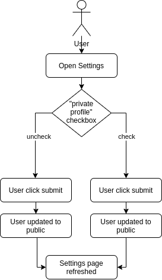
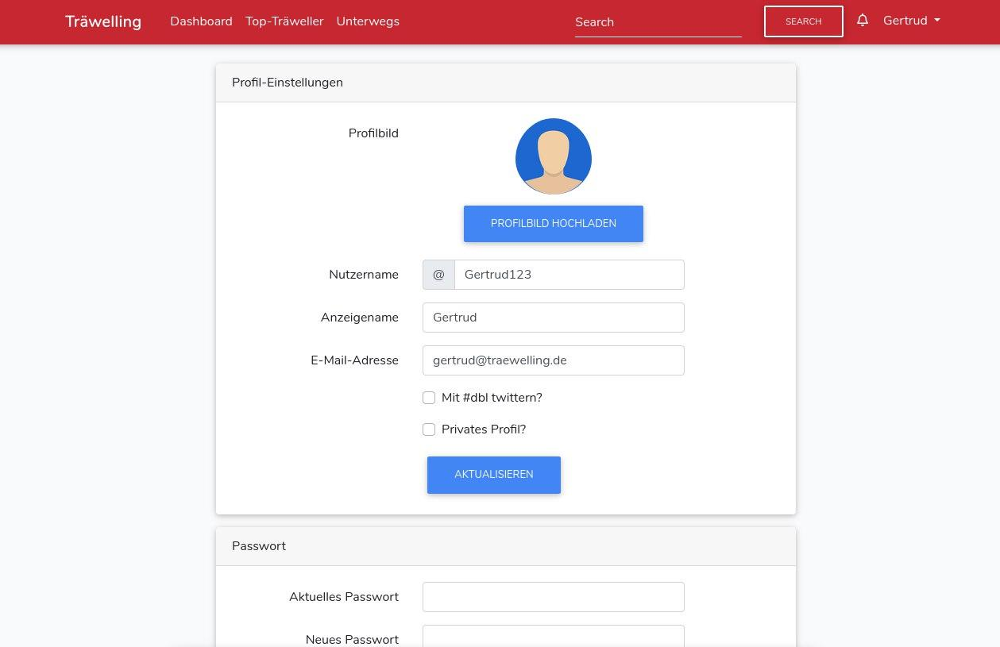

# 1 Use-Case Name
Change profile to private

## 1.1 Brief Description
In order to ensure most privacy, a user can set their profile to "private". 
This means, that other users cannot access this profile unless they follow them. 

This UC describes the change of the profile setting.

# 2 Flow of Events
## 2.1 Basic Flow
- User opens the settings
- User checks "private profile?" mark
- User clicks "submit"
- Settings page refreshes

### 2.1.1 Activity Diagram


### 2.1.2 Mock-up


### 2.1.3 Narrative
```gherkin
Feature: change profile to private

  As a signed in user
  i want to make my profile private.

  Background:
    And I am on any page

  Scenario: make profile private
    Given I am signed in with username "USER" and password "PASSWORD"
    And I am on any page
    When I press on the drowpdown with my username
    And I press on the "settings" button
    Then I check the "private profile?" checkbox
    And I click "submit"

  Scenario: make profile public
      Given I am signed in with username "USER" and password "PASSWORD"
      And I am on any page
      When I press on the drowpdown with my username
      And I press on the "settings" button
      Then I uncheck the "private profile?" checkbox
      And I click "submit"
```

## 2.2 Alternative Flows
(n/a)

# 3 Special Requirements
(n/a)

# 4 Preconditions
## 4.1 Login
The user has to be logged in to the system.

# 5 Postconditions
(n/a)
 
# 6 Extension Points
(n/a)