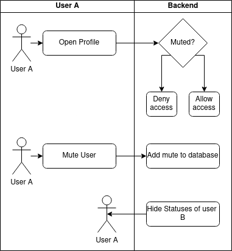

# 1 Use-Case Name
Mute User

## 1.1 Brief Description
In order to tidy up the global dashboard of a user, they are able to "mute"
other users. This will hide their posts of the dashboard.

This UC describes the process in muting a profile.

# 2 Flow of Events
## 2.1 Basic Flow
- User A opens profile page of user B 
- User a clicks "mute" on user B
- User A can no longer access profile and statuses of user B

### 2.1.1 Activity Diagram


### 2.1.2 Mock-up


### 2.1.3 Narrative
```gherkin
Feature: change profile to private

  As a signed in user
  i want to mute another user.

  Background:
    Given A user called Peter and a user called Mary
    

  Scenario: Peter tries to access Mary's profile
    Given I am signed in as Peter
    And Peter has muted Mary
    When I try to acces Mary's profile page
    Then I should see "The profile of Mary is muted"

  Scenario: Peter mutes Mary
      Given I am signed in as Peter
      When I try to mute Mary
      Then I should see "User muted"
      Then Peter should see a notification "The profile of Mary is muted"
```

## 2.2 Alternative Flows
(n/a)

# 3 Special Requirements
(n/a)

# 4 Preconditions
## 4.1 Login
The user has to be logged in to the system.
User A has not muted User B.

# 5 Postconditions
User A now has muted User B.
 
# 6 Extension Points
(n/a)
