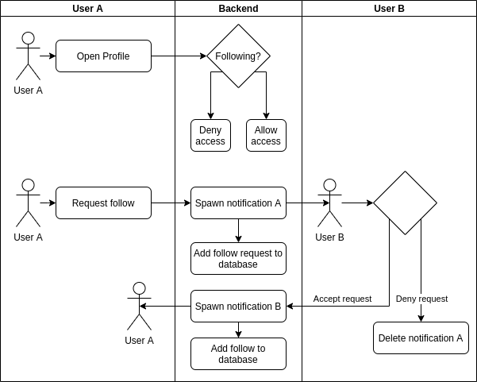
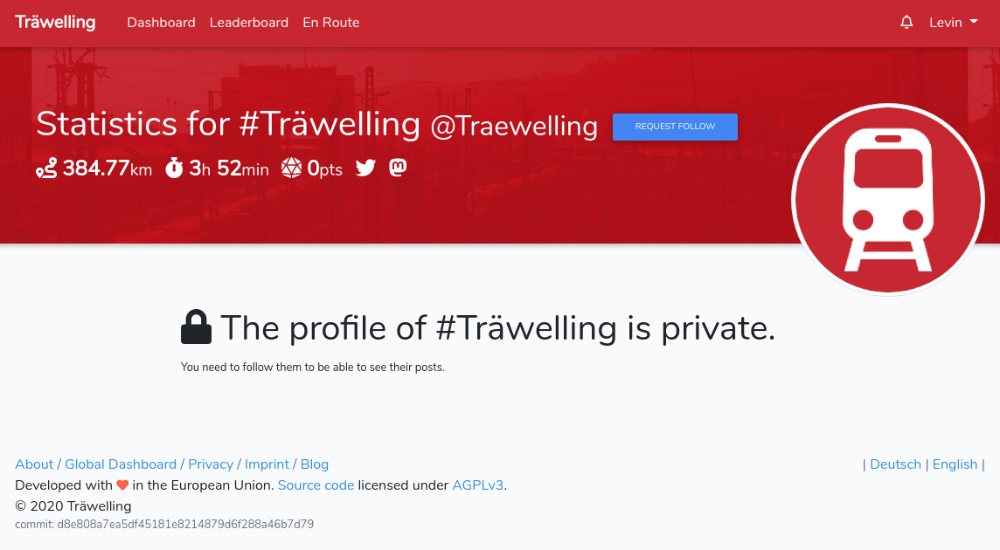

# 1 Use-Case Name
Request Follow

## 1.1 Brief Description
In order to ensure most privacy, a user can set their profile to "private". 
This means, that other users cannot access this profile unless they follow them. 

This UC describes the process in following a private profile.

# 2 Flow of Events
## 2.1 Basic Flow
- User A opens profile page of user B they don't follow
- User requests a follow to user B
- User B accepts follow request
- User A can access profile and statuses of user B

### 2.1.1 Activity Diagram


### 2.1.2 Mock-up


### 2.1.3 Narrative
```gherkin
Feature: change profile to private

  As a signed in user
  i want to follow a private user.

  Background:
    Given A user called Peter and a user called Mary
    And Mary has a private profile
    And Peter doesn't follow Mary
    

  Scenario: Peter tries to access Mary's profile
    Given I am signed in as Peter
    When I try to acces Mary's profile page
    Then I should see "The profile of Mary is private"

  Scenario: Peter follows Mary
      Given I am signed in as Peter
      When I try to follow Mary
      Then I should see "Follow request to Mary sent"
      Then Mary should see a notification "Peter has requested to follow you"
      Given I am signed in as Mary
      When I accept Peter's follow request
      Then Peter should see a notification "Mary has accepted your follow request"
```

## 2.2 Alternative Flows
(n/a)

# 3 Special Requirements
(n/a)

# 4 Preconditions
## 4.1 Login
The user has to be logged in to the system.
User A doesn't follow User B.

# 5 Postconditions
User A now follows User B.
 
# 6 Extension Points
(n/a)