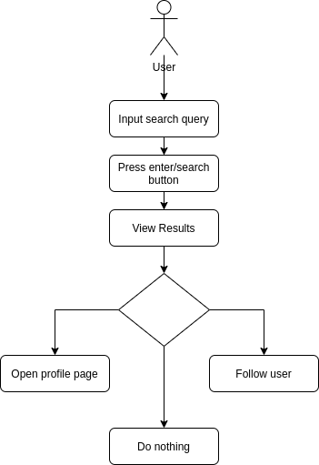
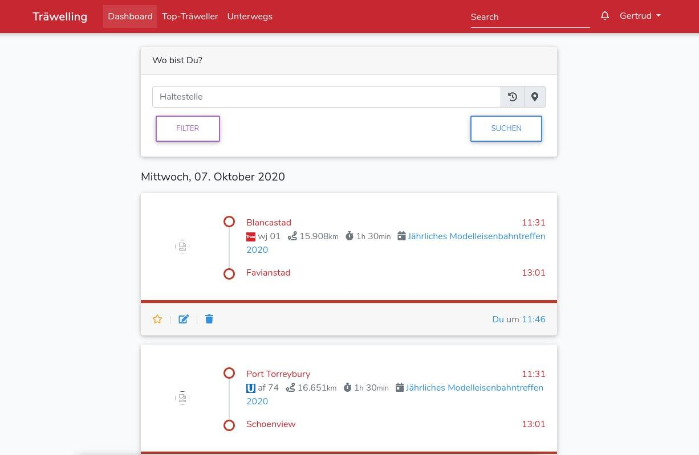
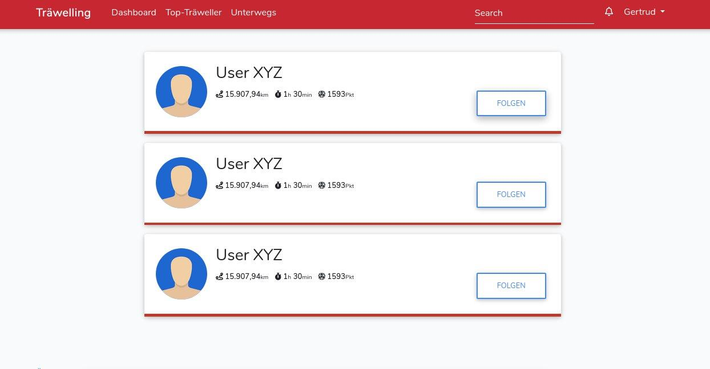

# 1 Use-Case Name
Search User

## 1.1 Brief Description
There are a thousand ways to search in the world wide web but only two ways in Träwelling: Direct access and a search bar.

In the search results the users will be listed one by one with a profile picture, the names, statistics and a follow/unfollow-button.

# 2 Flow of Events
## 2.1 Basic Flow
- User clicks in the "search" field
- User fills out the form
- User clicks "search"
- User is redirected on the results page
     - User can follow directly
     - User can go to profile page

### 2.1.1 Activity Diagram


### 2.1.2 Mock-up



### 2.1.3 Narrative
```gherkin
Feature: user search

  As a signed in user
  i want to search for another user.

  Background:
    And I am on any page

  Scenario: search user
    Given I am signed in with username "USER" and password "PASSWORD"
    And I am on any page
    When I fill out the "search" form
    And I press the "search" button
    Then I am on the "search results" page
```

## 2.2 Alternative Flows
(n/a)

# 3 Special Requirements
(n/a)

# 4 Preconditions
## 4.1 Login
The user has to be logged in to the system.

# 5 Postconditions
(n/a)
 
# 6 Extension Points
(n/a)